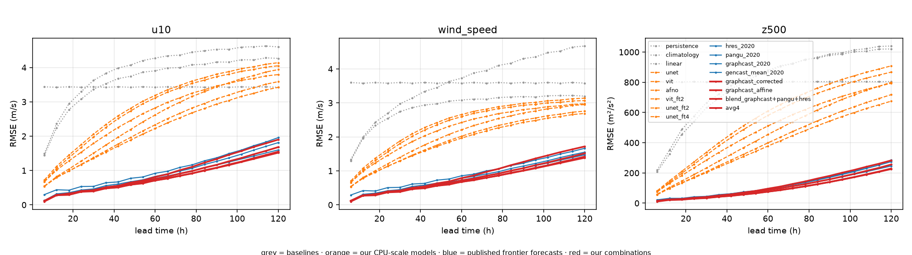
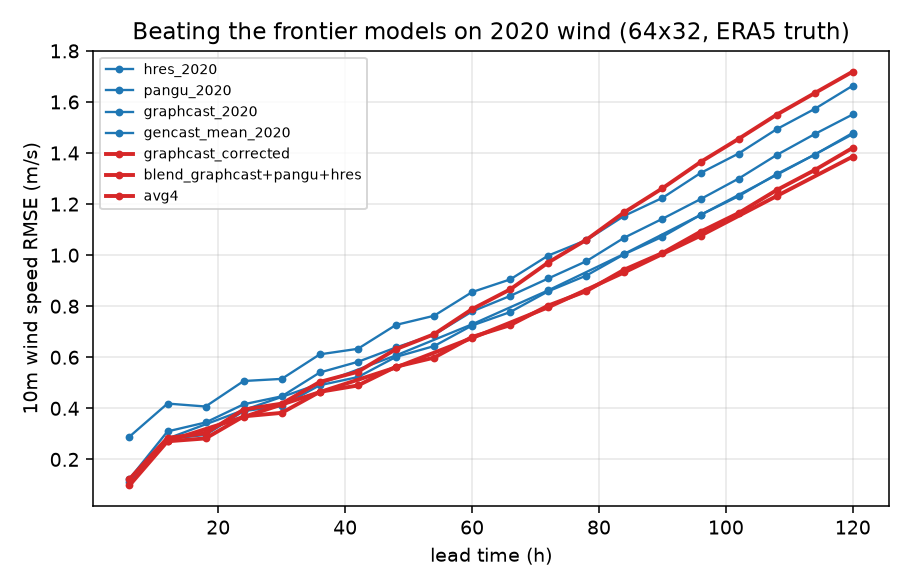

# Results

*Generated by `scripts/make_report.py`. Latitude-weighted RMSE on 2020,
00/12 UTC init times, verified against ERA5 at 64x32 (5.625 deg).*

## How to read these tables

Every row is scored by the same code on the same init times and truth.
The rows fall into four groups:

| group | what it is |
|---|---|
| baselines | persistence, climatology, per-pixel ridge regression |
| ours (from scratch) | U-Net / ViT / AFNO / mesh-GNN trained here on 4 CPU cores at 5.625 deg, `_ft2`/`_ft4` = rollout fine-tuned |
| published frontier forecasts | the actual GraphCast / GenCast / Pangu / HRES forecasts, produced at 0.25 deg and regridded to 64x32 by WeatherBench 2 |
| ours: combinations | post-processing and blends built *on top of* those published forecasts |

Our from-scratch models are **not** a like-for-like test of the architectures:
the frontier models used hundreds of GPU/TPU-days at 0.25 deg. Treat those rows
as the reference ceiling. The comparable published anchor at our resolution is
Rasp & Thuerey 2021 (ResNet, 5.625 deg). Their ERA5-only model -- the one
comparable to ours, since we do no pretraining -- scores z500 RMSE 314 / 561
m2/s2 at 3/5 days. Their widely-quoted 268 / 523 requires pretraining on ~150
years of CMIP6, and an earlier version of this line quoted it as if it were the
ERA5-only figure (with a 5-day number taken from a third, 'continuous' model).
The blend rows *are* like-for-like -- they beat those models on their own
published forecasts, at the resolution everything here is scored on.

## The Rasp & Thuerey 2021 recreation (scored on 2017-2018)

Separate from every table below, which is scored on 2020. This model
is scored on the paper's own test years so the comparison is
like-for-like: same 64x32 grid, same latitude-weighted RMSE.

### 72 h lead (single model, 2906 inits)

| variable | ours | R&T ERA5-only | vs | R&T CMIP6-pretrained |
|---|---|---|---|---|
| z500 | **306.67** | 314.0 | -2.3% | 268.0 |
| t850 | **1.53** | 1.79 | -14.3% | 1.65 |
| t2m | **1.21** | 1.53 | -21.1% | 1.42 |

### 120 h lead (single model, 2898 inits)

| variable | ours | R&T ERA5-only | vs | R&T CMIP6-pretrained |
|---|---|---|---|---|
| z500 | **593.00** | 561.0 | +5.7% | 523.0 |
| t850 | **2.55** | 2.82 | -9.6% | 2.52 |
| t2m | **1.90** | 2.32 | -18.3% | 2.03 |

Their ERA5-only row is the comparable one -- this model does no
pretraining. The pretrained column is shown because it is the number
usually quoted, and it costs ~150 years of CMIP6 data to reach.

## Sharpness: what RMSE cannot see

An RMSE-optimal forecast is the conditional mean, so every model
below is blurred by construction. For wind that matters because
power goes as v^3. `spec` is the share of high-wavenumber power the
forecast retains against ERA5 (1.0 = right), and `cf_bias` is the
capacity-factor error through a turbine power curve.

### 24 h

| model | ws RMSE | var ratio | spec | 95th-pct bias | cf bias |
|---|---|---|---|---|---|
| avg4 (mean of 4) | 0.366 | 0.996 | 0.946 | -0.065 | -0.0020 |
| fuxi_2020 | 0.384 | 0.997 | 0.944 | -0.086 | -0.0019 |
| graphcast_2020 | 0.390 | 0.996 | 0.938 | -0.088 | -0.0035 |
| gencast_mean_2020 | 0.393 | 0.995 | 0.951 | -0.082 | -0.0026 |
| pangu_2020 | 0.416 | 0.996 | 0.949 | -0.068 | -0.0018 |
| hres_2020 | 0.507 | 1.003 | 0.999 | -0.008 | +0.0022 |

### 72 h

| model | ws RMSE | var ratio | spec | 95th-pct bias | cf bias |
|---|---|---|---|---|---|
| avg4 (mean of 4) | 0.798 | 0.962 | 0.853 | -0.537 | -0.0087 |
| fuxi_2020 | 0.854 | 0.970 | 0.875 | -0.522 | -0.0070 |
| graphcast_2020 | 0.861 | 0.955 | 0.836 | -0.631 | -0.0118 |
| gencast_mean_2020 | 0.864 | 0.967 | 0.846 | -0.587 | -0.0083 |
| pangu_2020 | 0.911 | 0.979 | 0.919 | -0.442 | -0.0043 |
| hres_2020 | 1.000 | 0.994 | 0.989 | -0.356 | +0.0003 |

### 120 h

| model | ws RMSE | var ratio | spec | 95th-pct bias | cf bias |
|---|---|---|---|---|---|
| avg4 (mean of 4) | 1.392 | 0.897 | 0.710 | -1.673 | -0.0221 |
| fuxi_2020 | 1.473 | 0.940 | 0.819 | -1.427 | -0.0129 |
| gencast_mean_2020 | 1.478 | 0.885 | 0.659 | -1.943 | -0.0251 |
| graphcast_2020 | 1.486 | 0.922 | 0.773 | -1.562 | -0.0190 |
| pangu_2020 | 1.556 | 0.968 | 0.893 | -1.273 | -0.0066 |
| hres_2020 | 1.670 | 0.991 | 0.958 | -1.270 | -0.0009 |

The ordering is close to an inversion of the RMSE ordering: the
sharpest forecast is the physics model, which is last on RMSE.

### Spectral recalibration

One amplification factor per zonal wavenumber per lead, fitted
on held-out inits. RMSE is shown alongside because sharpening
always costs it -- reporting only the improved column would be
the trick this section exists to avoid.

| model | variant | lead | ws RMSE | spec | cf bias |
|---|---|---|---|---|---|
| avg4 (mean of 4) | raw | 24 h | 0.363 | 0.944 | -0.0022 |
| avg4 (mean of 4) | spectral | 24 h | 0.364 | 0.998 | -0.0001 |
| graphcast_2020 | raw | 24 h | 0.389 | 0.936 | -0.0040 |
| graphcast_2020 | spectral | 24 h | 0.388 | 0.999 | -0.0012 |
| pangu_2020 | raw | 24 h | 0.412 | 0.947 | -0.0020 |
| pangu_2020 | spectral | 24 h | 0.414 | 0.996 | -0.0002 |
| gencast_mean_2020 | raw | 24 h | 0.391 | 0.951 | -0.0029 |
| gencast_mean_2020 | spectral | 24 h | 0.392 | 1.001 | -0.0006 |
| fuxi_2020 | raw | 24 h | 0.381 | 0.941 | -0.0021 |
| fuxi_2020 | spectral | 24 h | 0.382 | 0.998 | -0.0001 |
| hres_2020 | raw | 24 h | 0.499 | 0.996 | +0.0023 |
| hres_2020 | spectral | 24 h | 0.500 | 0.999 | +0.0018 |
| avg4 (mean of 4) | raw | 72 h | 0.786 | 0.858 | -0.0088 |
| avg4 (mean of 4) | spectral | 72 h | 0.789 | 1.012 | -0.0001 |
| graphcast_2020 | raw | 72 h | 0.855 | 0.840 | -0.0120 |
| graphcast_2020 | spectral | 72 h | 0.857 | 1.011 | -0.0010 |
| pangu_2020 | raw | 72 h | 0.901 | 0.920 | -0.0047 |
| pangu_2020 | spectral | 72 h | 0.913 | 1.009 | +0.0005 |
| gencast_mean_2020 | raw | 72 h | 0.854 | 0.849 | -0.0086 |
| gencast_mean_2020 | spectral | 72 h | 0.859 | 1.005 | -0.0005 |
| fuxi_2020 | raw | 72 h | 0.843 | 0.877 | -0.0069 |
| fuxi_2020 | spectral | 72 h | 0.852 | 1.004 | +0.0006 |
| hres_2020 | raw | 72 h | 0.988 | 1.003 | +0.0003 |
| hres_2020 | spectral | 72 h | 0.992 | 1.019 | +0.0015 |
| avg4 (mean of 4) | raw | 120 h | 1.376 | 0.713 | -0.0216 |
| avg4 (mean of 4) | spectral | 120 h | 1.388 | 1.022 | +0.0003 |
| graphcast_2020 | raw | 120 h | 1.466 | 0.777 | -0.0189 |
| graphcast_2020 | spectral | 120 h | 1.487 | 1.001 | -0.0017 |
| pangu_2020 | raw | 120 h | 1.548 | 0.896 | -0.0065 |
| pangu_2020 | spectral | 120 h | 1.571 | 1.014 | +0.0016 |
| gencast_mean_2020 | raw | 120 h | 1.465 | 0.663 | -0.0250 |
| gencast_mean_2020 | spectral | 120 h | 1.470 | 1.011 | -0.0013 |
| fuxi_2020 | raw | 120 h | 1.452 | 0.817 | -0.0130 |
| fuxi_2020 | spectral | 120 h | 1.478 | 1.001 | +0.0010 |
| hres_2020 | raw | 120 h | 1.662 | 0.955 | +0.0002 |
| hres_2020 | spectral | 120 h | 1.680 | 1.009 | +0.0051 |

HRES is the negative control: it is already sharp, so the
correction has nothing to restore and makes it worse. A
post-processor that improved every model equally would be a
metric artefact rather than a physical correction.

## u10 — RMSE (m/s) at 24/72/120 h

| model                      |      24 |      72 |     120 |
|:---------------------------|--------:|--------:|--------:|
| persistence                |   3.299 |   4.361 |   4.6   |
| climatology                |   3.426 |   3.426 |   3.426 |
| linear                     |   3.081 |   3.998 |   4.267 |
| unet                       |   1.275 |   2.989 |   3.941 |
| vit                        |   1.678 |   3.408 |   4.051 |
| afno                       |   1.757 |   3.478 |   4.141 |
| graph                      |   2.341 |   3.805 |   4.502 |
| vit_ft2                    |   1.536 |   3.118 |   3.795 |
| unet_ft2                   |   1.183 |   2.665 |   3.59  |
| unet_ft4                   |   1.172 |   2.535 |   3.423 |
| hres_2020                  |   0.535 |   1.09  |   1.96  |
| pangu_2020                 |   0.433 |   0.983 |   1.814 |
| graphcast_2020             |   0.4   |   0.912 |   1.687 |
| gencast_mean_2020          |   0.407 |   0.917 |   1.601 |
| graphcast_corrected        |   0.405 |   1.01  |   1.902 |
| graphcast_affine           |   0.399 |   0.911 |   1.683 |
| blend_graphcast+pangu+hres |   0.382 |   0.851 |   1.551 |
| avg4                       |   0.38  |   0.843 |   1.52  |
| afno_ft2                   |   1.655 |   3.262 |   3.909 |
| anchor72                   | nan     |   2.399 | nan     |
| avg4ml                     |   0.38  |   0.865 |   1.559 |
| avg5                       |   0.374 |   0.838 |   1.516 |
| direct120                  | nan     | nan     |   3.214 |
| direct72                   | nan     |   2.525 | nan     |
| fuxi_2020                  |   0.396 |   0.915 |   1.692 |
| graph_6k                   |   2.234 |   3.65  |   4.285 |
| levels120                  | nan     | nan     |   3.21  |
| levels72                   | nan     |   2.392 | nan     |
| resnet72                   | nan     |   2.864 | nan     |
| resnet72_big               | nan     |   2.554 | nan     |
| unet_long                  |   1.101 |   2.609 |   3.597 |
| unet_long_ft2              |   1.066 |   2.501 |   3.499 |
| unet_long_ft4              |   1.058 |   2.389 |   3.344 |

## v10 — RMSE (m/s) at 24/72/120 h

| model                      |      24 |      72 |     120 |
|:---------------------------|--------:|--------:|--------:|
| persistence                |   4.066 |   4.937 |   5.038 |
| climatology                |   3.581 |   3.582 |   3.584 |
| linear                     |   3.554 |   3.917 |   3.996 |
| unet                       |   1.37  |   3.134 |   4.126 |
| vit                        |   1.77  |   3.575 |   4.222 |
| afno                       |   1.862 |   3.684 |   4.369 |
| graph                      |   2.553 |   3.87  |   4.349 |
| vit_ft2                    |   1.637 |   3.284 |   3.987 |
| unet_ft2                   |   1.271 |   2.837 |   3.829 |
| unet_ft4                   |   1.258 |   2.696 |   3.657 |
| hres_2020                  |   0.56  |   1.172 |   2.115 |
| pangu_2020                 |   0.461 |   1.069 |   1.98  |
| graphcast_2020             |   0.425 |   0.985 |   1.826 |
| gencast_mean_2020          |   0.433 |   0.991 |   1.735 |
| graphcast_corrected        |   0.432 |   1.102 |   2.072 |
| graphcast_affine           |   0.424 |   0.985 |   1.818 |
| blend_graphcast+pangu+hres |   0.405 |   0.922 |   1.681 |
| avg4                       |   0.404 |   0.913 |   1.649 |
| afno_ft2                   |   1.751 |   3.477 |   4.171 |
| anchor72                   | nan     |   2.578 | nan     |
| avg4ml                     |   0.405 |   0.936 |   1.694 |
| avg5                       |   0.398 |   0.907 |   1.647 |
| direct120                  | nan     | nan     |   3.47  |
| direct72                   | nan     |   2.714 | nan     |
| fuxi_2020                  |   0.422 |   0.991 |   1.841 |
| graph_6k                   |   2.436 |   3.766 |   4.187 |
| levels120                  | nan     | nan     |   3.486 |
| levels72                   | nan     |   2.57  | nan     |
| resnet72                   | nan     |   3.032 | nan     |
| resnet72_big               | nan     |   2.706 | nan     |
| unet_long                  |   1.182 |   2.777 |   3.81  |
| unet_long_ft2              |   1.145 |   2.667 |   3.713 |
| unet_long_ft4              |   1.137 |   2.551 |   3.561 |

## wind_speed — RMSE (m/s) at 24/72/120 h

| model                      |      24 |      72 |     120 |
|:---------------------------|--------:|--------:|--------:|
| persistence                |   2.545 |   3.11  |   3.199 |
| climatology                |   3.581 |   3.582 |   3.583 |
| linear                     |   2.692 |   3.955 |   4.675 |
| unet                       |   1.208 |   2.439 |   2.953 |
| vit                        |   1.56  |   2.76  |   3.068 |
| afno                       |   1.631 |   2.818 |   3.14  |
| graph                      |   2.181 |   3.311 |   3.652 |
| vit_ft2                    |   1.458 |   2.603 |   2.974 |
| unet_ft2                   |   1.135 |   2.237 |   2.759 |
| unet_ft4                   |   1.136 |   2.172 |   2.691 |
| hres_2020                  |   0.507 |   0.998 |   1.664 |
| pangu_2020                 |   0.416 |   0.909 |   1.551 |
| graphcast_2020             |   0.389 |   0.858 |   1.479 |
| gencast_mean_2020          |   0.393 |   0.862 |   1.474 |
| graphcast_corrected        |   0.395 |   0.971 |   1.719 |
| graphcast_affine           |   0.388 |   0.855 |   1.518 |
| blend_graphcast+pangu+hres |   0.369 |   0.803 |   1.421 |
| avg4                       |   0.366 |   0.796 |   1.386 |
| afno_ft2                   |   1.552 |   2.71  |   3.047 |
| anchor72                   | nan     |   2.226 | nan     |
| avg4ml                     |   0.368 |   0.814 |   1.404 |
| avg5                       |   0.361 |   0.791 |   1.38  |
| direct120                  | nan     | nan     |   3.162 |
| direct72                   | nan     |   2.333 | nan     |
| fuxi_2020                  |   0.383 |   0.853 |   1.47  |
| graph_6k                   |   2.105 |   3.327 |   3.75  |
| levels120                  | nan     | nan     |   3.068 |
| levels72                   | nan     |   2.229 | nan     |
| resnet72                   | nan     |   2.752 | nan     |
| resnet72_big               | nan     |   2.408 | nan     |
| unet_long                  |   1.044 |   2.174 |   2.729 |
| unet_long_ft2              |   1.019 |   2.107 |   2.675 |
| unet_long_ft4              |   1.021 |   2.047 |   2.606 |

## u850 — RMSE (m/s) at 24/72/120 h

| model                      |      24 |      72 |     120 |
|:---------------------------|--------:|--------:|--------:|
| persistence                |   4.623 |   6.338 |   6.746 |
| climatology                |   5.111 |   5.111 |   5.112 |
| linear                     |   4.418 |   5.782 |   6.16  |
| unet                       |   1.948 |   4.373 |   5.789 |
| vit                        |   2.516 |   4.967 |   5.935 |
| afno                       |   2.626 |   5.089 |   6.098 |
| graph                      |   3.393 |   5.507 |   6.509 |
| vit_ft2                    |   2.313 |   4.556 |   5.558 |
| unet_ft2                   |   1.804 |   3.881 |   5.212 |
| unet_ft4                   |   1.778 |   3.685 |   4.946 |
| hres_2020                  |   0.812 |   1.582 |   2.79  |
| pangu_2020                 |   0.705 |   1.441 |   2.593 |
| graphcast_2020             |   0.629 |   1.334 |   2.407 |
| gencast_mean_2020          |   0.656 |   1.353 |   2.306 |
| graphcast_corrected        |   0.638 |   1.467 |   2.699 |
| graphcast_affine           |   0.63  |   1.333 |   2.404 |
| blend_graphcast+pangu+hres |   0.609 |   1.249 |   2.22  |
| avg4                       |   0.612 |   1.24  |   2.18  |
| afno_ft2                   |   2.48  |   4.764 |   5.729 |
| anchor72                   | nan     |   3.481 | nan     |
| avg4ml                     |   0.614 |   1.27  |   2.233 |
| avg5                       |   0.604 |   1.233 |   2.173 |
| direct120                  | nan     | nan     |   4.729 |
| direct72                   | nan     |   3.684 | nan     |
| fuxi_2020                  |   0.639 |   1.343 |   2.417 |
| graph_6k                   |   3.256 |   5.357 |   6.347 |
| levels120                  | nan     | nan     |   4.707 |
| levels72                   | nan     |   3.466 | nan     |
| resnet72                   | nan     |   4.135 | nan     |
| resnet72_big               | nan     |   3.698 | nan     |
| unet_long                  |   1.703 |   3.811 |   5.223 |
| unet_long_ft2              |   1.644 |   3.652 |   5.063 |
| unet_long_ft4              |   1.624 |   3.482 |   4.822 |

## v850 — RMSE (m/s) at 24/72/120 h

| model                      |      24 |      72 |     120 |
|:---------------------------|--------:|--------:|--------:|
| persistence                |   5.631 |   6.906 |   7.073 |
| climatology                |   5.038 |   5.041 |   5.042 |
| linear                     |   4.892 |   5.326 |   5.321 |
| unet                       |   2.076 |   4.436 |   5.733 |
| vit                        |   2.64  |   5.059 |   5.881 |
| afno                       |   2.756 |   5.202 |   6.053 |
| graph                      |   3.686 |   5.478 |   6.181 |
| vit_ft2                    |   2.439 |   4.64  |   5.509 |
| unet_ft2                   |   1.933 |   4.038 |   5.325 |
| unet_ft4                   |   1.905 |   3.836 |   5.07  |
| hres_2020                  |   0.844 |   1.693 |   2.999 |
| pangu_2020                 |   0.751 |   1.58  |   2.825 |
| graphcast_2020             |   0.667 |   1.45  |   2.601 |
| gencast_mean_2020          |   0.698 |   1.467 |   2.489 |
| graphcast_corrected        |   0.677 |   1.611 |   2.929 |
| graphcast_affine           |   0.667 |   1.45  |   2.59  |
| blend_graphcast+pangu+hres |   0.643 |   1.359 |   2.402 |
| avg4                       |   0.646 |   1.349 |   2.361 |
| afno_ft2                   |   2.596 |   4.895 |   5.757 |
| anchor72                   | nan     |   3.677 | nan     |
| avg4ml                     |   0.653 |   1.386 |   2.423 |
| avg5                       |   0.639 |   1.343 |   2.356 |
| direct120                  | nan     | nan     |   4.883 |
| direct72                   | nan     |   3.885 | nan     |
| fuxi_2020                  |   0.682 |   1.467 |   2.627 |
| graph_6k                   |   3.544 |   5.292 |   5.808 |
| levels120                  | nan     | nan     |   4.905 |
| levels72                   | nan     |   3.667 | nan     |
| resnet72                   | nan     |   4.254 | nan     |
| resnet72_big               | nan     |   3.82  | nan     |
| unet_long                  |   1.828 |   3.985 |   5.335 |
| unet_long_ft2              |   1.764 |   3.825 |   5.192 |
| unet_long_ft4              |   1.743 |   3.654 |   4.961 |

## z500 — RMSE (m²/s²) at 24/72/120 h

| model                      |      24 |      72 |      120 |
|:---------------------------|--------:|--------:|---------:|
| persistence                | 576.505 | 924.728 | 1020.6   |
| climatology                | 804.255 | 804.994 |  805.31  |
| linear                     | 540.438 | 922.288 | 1040.07  |
| unet                       | 189.502 | 539.071 |  800.055 |
| vit                        | 258.079 | 660.617 |  867.547 |
| afno                       | 273.982 | 692.709 |  908.632 |
| graph                      | 385.216 | 793.787 |  994.675 |
| vit_ft2                    | 234.156 | 585.789 |  793.781 |
| unet_ft2                   | 172.112 | 474.145 |  718.226 |
| unet_ft4                   | 167.976 | 447.312 |  675.217 |
| hres_2020                  |  41.943 | 124.317 |  284.908 |
| pangu_2020                 |  38.514 | 121.521 |  274.482 |
| graphcast_2020             |  34.503 | 112.924 |  256.272 |
| gencast_mean_2020          |  33.934 | 112.233 |  245.855 |
| graphcast_corrected        |  35.786 | 127.281 |  282.836 |
| graphcast_affine           |  34.455 | 112.791 |  255.453 |
| blend_graphcast+pangu+hres |  30.032 |  98.835 |  229.22  |
| avg4                       |  29.911 |  98.429 |  225.859 |
| afno_ft2                   | 255.329 | 638.589 |  842.459 |
| anchor72                   | nan     | 387.445 |  nan     |
| avg4ml                     |  30.992 | 103.897 |  235.963 |
| avg5                       |  29.593 |  98.503 |  226.489 |
| direct120                  | nan     | nan     |  696.256 |
| direct72                   | nan     | 455.573 |  nan     |
| fuxi_2020                  |  34.774 | 113.825 |  258.58  |
| graph_6k                   | 364.392 | 772.292 |  976.437 |
| levels120                  | nan     | nan     |  671.925 |
| levels72                   | nan     | 393.746 |  nan     |
| resnet72                   | nan     | 437.629 |  nan     |
| resnet72_big               | nan     | 378.497 |  nan     |
| unet_long                  | 157.081 | 454.87  |  706.465 |
| unet_long_ft2              | 151.233 | 435.44  |  683.107 |
| unet_long_ft4              | 148.063 | 411.737 |  642.473 |

## t2m — RMSE (K) at 24/72/120 h

| model                      |      24 |      72 |     120 |
|:---------------------------|--------:|--------:|--------:|
| persistence                |   1.727 |   2.621 |   2.903 |
| climatology                |   2.446 |   2.445 |   2.443 |
| linear                     |   2.149 |   3.833 |   4.594 |
| unet                       |   1.064 |   1.955 |   2.67  |
| vit                        |   1.189 |   2.246 |   2.966 |
| afno                       |   1.243 |   2.351 |   3.091 |
| graph                      |   1.593 |   2.946 |   3.8   |
| vit_ft2                    |   1.169 |   2.117 |   2.784 |
| unet_ft2                   |   0.991 |   1.712 |   2.323 |
| unet_ft4                   |   1     |   1.68  |   2.257 |
| hres_2020                  |   0.689 |   0.875 |   1.223 |
| pangu_2020                 |   0.376 |   0.68  |   1.127 |
| graphcast_2020             |   0.351 |   0.602 |   0.997 |
| gencast_mean_2020          |   0.335 |   0.587 |   0.933 |
| graphcast_corrected        |   0.352 |   0.614 |   1.018 |
| graphcast_affine           |   0.351 |   0.602 |   0.995 |
| blend_graphcast+pangu+hres |   0.336 |   0.569 |   0.919 |
| avg4                       |   0.35  |   0.567 |   0.899 |
| afno_ft2                   |   1.231 |   2.269 |   2.972 |
| anchor72                   | nan     |   1.541 | nan     |
| avg4ml                     |   0.326 |   0.561 |   0.912 |
| avg5                       |   0.339 |   0.555 |   0.889 |
| direct120                  | nan     | nan     |   2.091 |
| direct72                   | nan     |   1.545 | nan     |
| fuxi_2020                  |   0.365 |   0.619 |   1.012 |
| graph_6k                   |   1.499 |   2.798 |   3.624 |
| levels120                  | nan     | nan     |   2.12  |
| levels72                   | nan     |   1.54  | nan     |
| resnet72                   | nan     |   1.978 | nan     |
| resnet72_big               | nan     |   1.742 | nan     |
| unet_long                  |   0.891 |   1.586 |   2.222 |
| unet_long_ft2              |   0.892 |   1.555 |   2.175 |
| unet_long_ft4              |   0.904 |   1.527 |   2.101 |

## 10m wind speed — ACC at 24/72/120 h

| model                      |      24 |      72 |     120 |
|:---------------------------|--------:|--------:|--------:|
| persistence                |   0.747 |   0.623 |   0.602 |
| climatology                |   0     |   0     |   0     |
| linear                     |   0.662 |   0.141 |  -0.138 |
| unet                       |   0.942 |   0.762 |   0.653 |
| vit                        |   0.9   |   0.659 |   0.569 |
| afno                       |   0.891 |   0.645 |   0.555 |
| graph                      |   0.793 |   0.449 |   0.353 |
| vit_ft2                    |   0.913 |   0.696 |   0.587 |
| unet_ft2                   |   0.948 |   0.792 |   0.679 |
| unet_ft4                   |   0.948 |   0.799 |   0.683 |
| hres_2020                  |   0.99  |   0.961 |   0.89  |
| pangu_2020                 |   0.993 |   0.967 |   0.903 |
| graphcast_2020             |   0.994 |   0.971 |   0.91  |
| gencast_mean_2020          |   0.994 |   0.97  |   0.911 |
| graphcast_corrected        |   0.994 |   0.963 |   0.876 |
| graphcast_affine           |   0.994 |   0.971 |   0.906 |
| blend_graphcast+pangu+hres |   0.995 |   0.974 |   0.918 |
| avg4                       |   0.995 |   0.975 |   0.921 |
| afno_ft2                   |   0.901 |   0.668 |   0.567 |
| anchor72                   | nan     |   0.783 | nan     |
| avg4ml                     |   0.995 |   0.974 |   0.919 |
| avg5                       |   0.995 |   0.975 |   0.922 |
| direct120                  | nan     | nan     |   0.471 |
| direct72                   | nan     |   0.759 | nan     |
| fuxi_2020                  |   0.994 |   0.971 |   0.911 |
| graph_6k                   |   0.808 |   0.428 |   0.276 |
| levels120                  | nan     | nan     |   0.515 |
| levels72                   | nan     |   0.782 | nan     |
| resnet72                   | nan     |   0.639 | nan     |
| resnet72_big               | nan     |   0.739 | nan     |
| unet_long                  |   0.956 |   0.807 |   0.692 |
| unet_long_ft2              |   0.958 |   0.817 |   0.7   |
| unet_long_ft4              |   0.958 |   0.824 |   0.707 |

## Wind RMSE relative to GraphCast (%, negative = better)

| model                      |   u10@24h |   u10@72h |   u10@120h |   v10@24h |   v10@72h |   v10@120h |   wind_speed@24h |   wind_speed@72h |   wind_speed@120h |
|:---------------------------|----------:|----------:|-----------:|----------:|----------:|-----------:|-----------------:|-----------------:|------------------:|
| persistence                |     725.5 |     378.1 |      172.7 |     857.5 |     401.1 |      175.9 |            554   |            262.4 |             116.3 |
| climatology                |     757.3 |     275.6 |      103.1 |     743.3 |     263.6 |       96.3 |            820.5 |            317.3 |             142.3 |
| linear                     |     671   |     338.3 |      153   |     736.8 |     297.6 |      118.8 |            591.9 |            360.7 |             216.1 |
| unet                       |     219.1 |     227.7 |      133.7 |     222.6 |     218.1 |      125.9 |            210.5 |            184.2 |              99.7 |
| vit                        |     319.8 |     273.7 |      140.2 |     316.8 |     262.9 |      131.2 |            300.9 |            221.5 |             107.5 |
| afno                       |     339.7 |     281.3 |      145.5 |     338.5 |     274   |      139.3 |            319.3 |            228.3 |             112.3 |
| graph                      |     485.8 |     317.1 |      166.9 |     501.1 |     292.9 |      138.2 |            460.7 |            285.7 |             146.9 |
| vit_ft2                    |     284.3 |     241.8 |      125   |     285.4 |     233.4 |      118.3 |            274.6 |            203.3 |             101.1 |
| unet_ft2                   |     196.1 |     192.2 |      112.8 |     199.3 |     187.9 |      109.7 |            191.7 |            160.6 |              86.6 |
| unet_ft4                   |     193.4 |     177.9 |      103   |     196.3 |     173.6 |      100.3 |            192.1 |            153.1 |              82   |
| hres_2020                  |      33.9 |      19.5 |       16.2 |      31.9 |      19   |       15.8 |             30.3 |             16.3 |              12.5 |
| pangu_2020                 |       8.3 |       7.7 |        7.5 |       8.5 |       8.5 |        8.4 |              6.9 |              5.9 |               4.9 |
| gencast_mean_2020          |       1.7 |       0.5 |       -5.1 |       2.1 |       0.6 |       -5   |              1   |              0.4 |              -0.3 |
| graphcast_corrected        |       1.3 |      10.7 |       12.7 |       1.8 |      11.9 |       13.4 |              1.6 |             13.1 |              16.2 |
| graphcast_affine           |      -0   |      -0.1 |       -0.2 |      -0.1 |       0   |       -0.4 |             -0.4 |             -0.3 |               2.6 |
| blend_graphcast+pangu+hres |      -4.5 |      -6.7 |       -8.1 |      -4.6 |      -6.5 |       -7.9 |             -5.3 |             -6.5 |              -3.9 |
| avg4                       |      -4.8 |      -7.6 |       -9.9 |      -4.8 |      -7.4 |       -9.7 |             -5.9 |             -7.3 |              -6.3 |
| afno_ft2                   |     314   |     257.6 |      131.7 |     312.3 |     252.9 |      128.4 |            298.9 |            215.7 |             106.1 |
| anchor72                   |     nan   |     163   |      nan   |     nan   |     161.6 |      nan   |            nan   |            159.4 |             nan   |
| avg4ml                     |      -4.9 |      -5.2 |       -7.6 |      -4.7 |      -5   |       -7.2 |             -5.5 |             -5.2 |              -5   |
| avg5                       |      -6.4 |      -8.1 |      -10.1 |      -6.3 |      -7.9 |       -9.8 |             -7.3 |             -7.8 |              -6.7 |
| direct120                  |     nan   |     nan   |       90.5 |     nan   |     nan   |       90   |            nan   |            nan   |             113.8 |
| direct72                   |     nan   |     176.8 |      nan   |     nan   |     175.4 |      nan   |            nan   |            171.8 |             nan   |
| fuxi_2020                  |      -0.9 |       0.3 |        0.3 |      -0.7 |       0.6 |        0.8 |             -1.6 |             -0.6 |              -0.6 |
| graph_6k                   |     459   |     300.1 |      154   |     473.7 |     282.3 |      129.3 |            441.1 |            287.5 |             153.6 |
| levels120                  |     nan   |     nan   |       90.3 |     nan   |     nan   |       90.9 |            nan   |            nan   |             107.4 |
| levels72                   |     nan   |     162.2 |      nan   |     nan   |     160.9 |      nan   |            nan   |            159.6 |             nan   |
| resnet72                   |     nan   |     214   |      nan   |     nan   |     207.7 |      nan   |            nan   |            220.6 |             nan   |
| resnet72_big               |     nan   |     180   |      nan   |     nan   |     174.7 |      nan   |            nan   |            180.5 |             nan   |
| unet_long                  |     175.4 |     186   |      113.3 |     178.3 |     181.9 |      108.6 |            168.3 |            153.2 |              84.6 |
| unet_long_ft2              |     166.7 |     174.2 |      107.4 |     169.7 |     170.7 |      103.3 |            161.9 |            145.5 |              80.9 |
| unet_long_ft4              |     164.8 |     161.9 |       98.3 |     167.8 |     158.9 |       95   |            162.5 |            138.5 |              76.2 |

## Probabilistic: wind CRPS (m/s)

| model         |   ('u10', 24) |   ('u10', 72) |   ('u10', 120) |   ('v10', 24) |   ('v10', 72) |   ('v10', 120) |   ('wind_speed', 24) |   ('wind_speed', 72) |   ('wind_speed', 120) |
|:--------------|--------------:|--------------:|---------------:|--------------:|--------------:|---------------:|---------------------:|---------------------:|----------------------:|
| graphcast_det |         0.297 |         0.618 |          1.084 |         0.316 |         0.657 |          1.152 |                0.289 |                0.589 |                 0.984 |
| mme4          |         0.194 |         0.397 |          0.675 |         0.207 |         0.426 |          0.722 |                0.186 |                0.37  |                 0.598 |

## Figures

